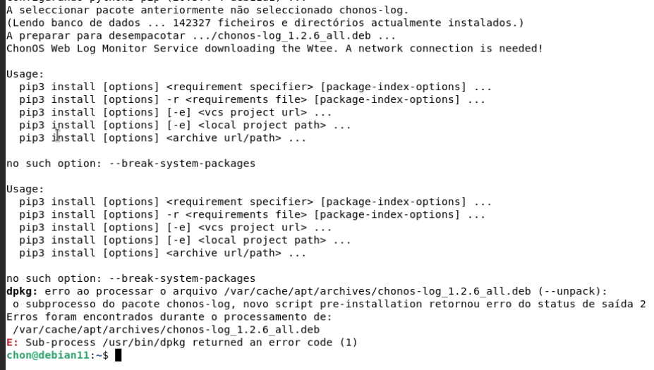

# Changelog
## 1.3.1 (2023-09-17)
Solving Issues [#3](https://github.com/chon-group/dpkg-chonos-log/issues/3) and [#4](https://github.com/chon-group/dpkg-chonos-log/issues/4) about the bug in Package python3-pip in (Ubuntu 22.04 and Mint 21.02). 

In this version the pip --version shows (python 3.10), so the WebLog feature, provided by [Wtee](https://pypi.org/project/wtee/) wasn't working.

## 1.3 (2023-09-16)
Solving Issue [#2](https://github.com/chon-group/dpkg-chonos-log/issues/2) about the problem in adption of [PEP 668 (Python Enhancement Proposal – Marking Python base environments as “externally managed”)](https://peps.python.org/pep-0668/) in differents versions of Linux Distribution that has been broken the instalation os chonos-log. 

For example:
```sh
    sudo pip3 install any --break-system-packages
``` 

+ Debian >= 12: Implements the PEP668, so in the instalation is necessary set the --break-system-packages 

+ Debian <= 11: Not implements the PEP668, so in the instalation the option --break broken the installer like below:



## 1.2.6 (2023-09-13)
Solving [Issue 14 of ChonIDE](https://github.com/chon-group/chonIDE/issues/14)
- Forcing python3-pip to install wtee
## 1.2.5 (2023-05-18)

- Adding Python 3.11 packages, in Debian 12.
## 1.2.0 (2023-04-30)
### Enhancements
- It adding an elegant way for other services to inform events.
## 1.0.0 (2023-04-23)
### Enhancements
- It implements the chonos-log as a background daemon.